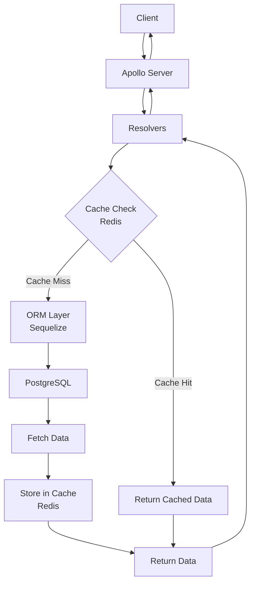

# Apollo server backend

Node server backend with GraphQL API using Apollo written in TypeScript. Database integration with Sequelize/PostgreSQL. Migrations to build initial data tables and seed data into them.

Includes a Python script for building data sets for the quiz game, see [scripts/readme.md](scripts/readme.md).

## Tech stack

| Component     | Used for                                                     | Status      |
| ------------- | ------------------------------------------------------------ | ----------- |
| Node.js       | Runtime environment                                          | Implemented |
| Axios         | HTTP client for communicating with the mock payment provider | Planned     |
| Express       | Web framework                                                | Implemented |
| Apollo Server | GraphQL framework                                            | Implemented |
| Sequelize     | ORM for database                                             | Implemented |
| Umzug         | Database migration tool                                      | Implemented |
| GraphQL       | API query language                                           | Implemented |
| Jsonwebtoken  | JSON web token utility for authentication and authorization  | Implemented |
| Pg            | PostgreSQL driver                                            | Implemented |
| Nodemon       | Development server hot-reloader                              | Implemented |
| Bcrypt        | Password hashing utility                                     | Implemented |
| Pino          | Logging utility                                              | Implemented |
| Dotenv        | Environment variable management utility                      | Implemented |
| Jest          | Unit testing framework                                       | Implemented |
| Supertest     | API testing utility                                          | Implemented |
| Prettier      | Code formatter                                               | Implemented |
| ESLint        | Linting utility                                              | Implemented |
| Typescript    | TypeScript compiler                                          | Implemented |
| Redis         |                                                              | Planned     |

## Installation

### Recommended

```shell
npm ci                  # Installs the project using the existing package-lock.json file
```

### Alternative

```shell
rm package-lock.json    # Removes the package-lock.json file
npm install             # Installs dependencies without using package-lock.json file
```

## Environment variables

```shell
POSTGRES_USER=postgres
POSTGRES_PASSWORD=postgres
POSTGRES_DB=postgres
POSTGRES_HOST=localhost
POSTGRES_PORT=5432
PASSWORD_SECRET=test-environment-super-secret-key
JWT_SECRET=super-secure-test-jwt-secret
```

## Commands

```shell
npm run dev             # starts development server with hot-reload
npm run test            # runs unit tests using Jest and Supertest
npm run lint            # runs linter using ESLint
npm run format          # runs Prettier code formatter
npm run build           # builds the project
npm start               # starts production server
```

## Flow



## Files

```shell
├── Dockerfile
├── eslint.config.mjs
├── jest.config.ts
├── package-lock.json
├── package.json
├── readme.md
├── scripts
│   ├── dataBuilder.py
│   └── readme.md
├── src
│   ├── data
│   │   ├── countries.json
│   │   ├── pokemon.json
│   │   ├── pokemonOriginal.json
│   │   ├── testScores.json
│   │   └── testUsers.json
│   ├── db
│   │   ├── index.ts
│   │   ├── models
│   │   │   ├── Country.ts
│   │   │   ├── Pokemon.ts
│   │   │   ├── Score.ts
│   │   │   └── User.ts
│   │   └── sequelize.ts
│   ├── index.ts
│   ├── migrations
│   │   ├── 00_initialize_and_seed.ts
│   │   ├── 01_initialize_users.ts
│   │   ├── 02_seed_test_users_on_dev.ts
│   │   ├── 03_initialize_scores.ts
│   │   └── 04_seed_test_scores_on_dev.ts
│   ├── models
│   │   ├── ObjectType.ts
│   │   └── User.ts
│   ├── plugins
│   │   └── loggingPlugin.ts
│   ├── schema
│   │   ├── resolvers
│   │   │   ├── authResolvers.ts
│   │   │   ├── countryResolvers.ts
│   │   │   ├── pokemonResolvers.ts
│   │   │   ├── scoreResolvers.ts
│   │   │   └── userResolvers.ts
│   │   ├── resolvers.ts
│   │   └── typeDefs.ts
│   ├── server.ts
│   └── utils
│       └── logger.ts
├── tests
│   ├── e2e
│   │   ├── auth_and_users.test.ts
│   │   ├── countries.test.ts
│   │   ├── pokemon.test.ts
│   │   └── smoke.test.ts
│   ├── readme.md
│   ├── rest
│   │   ├── countries.http
│   │   ├── country.http
│   │   └── login.http
│   └── tsconfig.json
└── tsconfig.json
```
