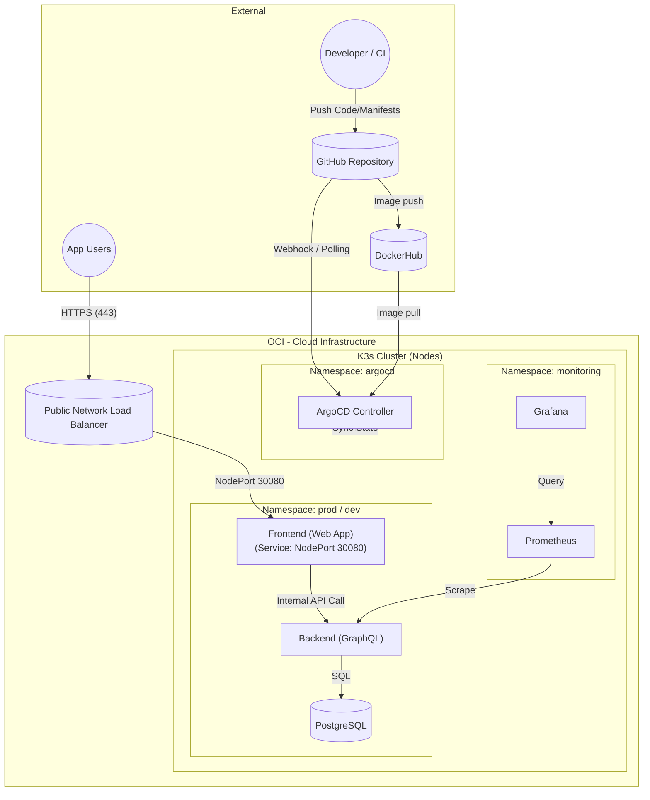

# K3s cluster README

For now, kubectl can not be used from the developer's local machine due to our strict network security rules. Instead, we'll use bastion to ssh into the master node and run kubectl commands there. Another option would be to use Cloud shell. Later, we'll automate the deployment so that the master node pulls the manifests from github using ArgoCD.

## Future Architecture

