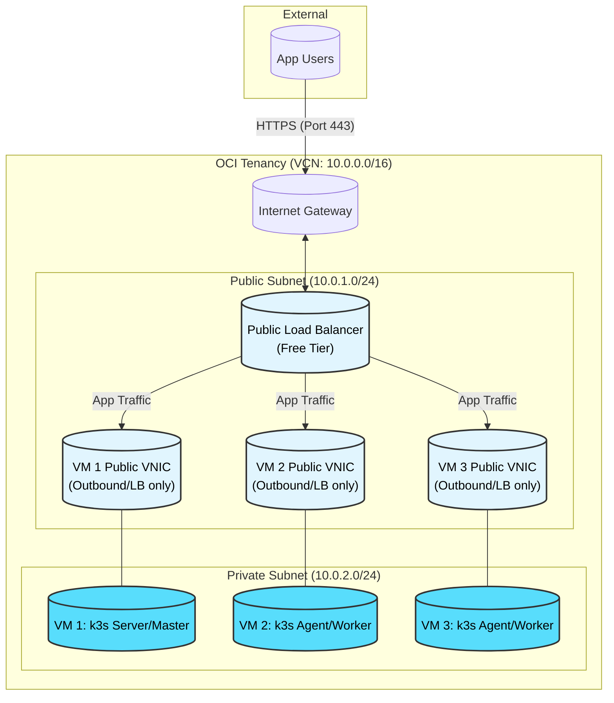
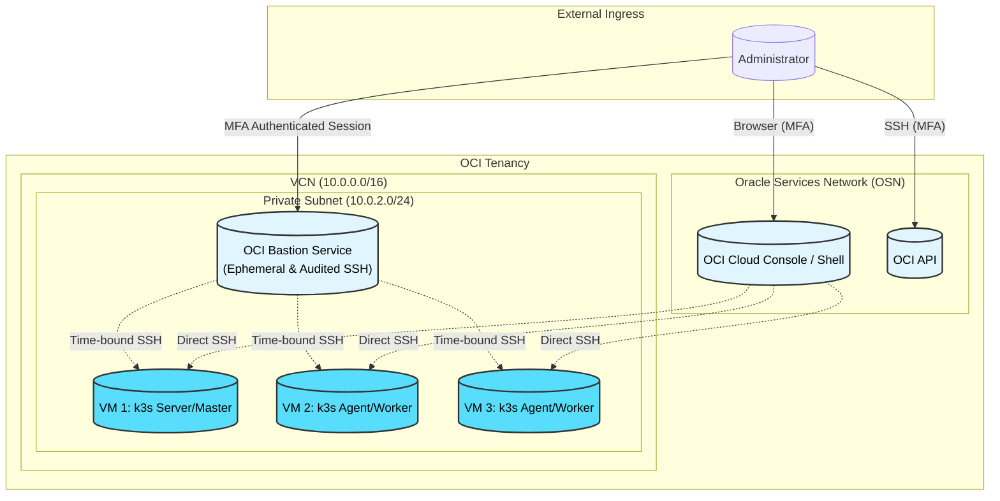
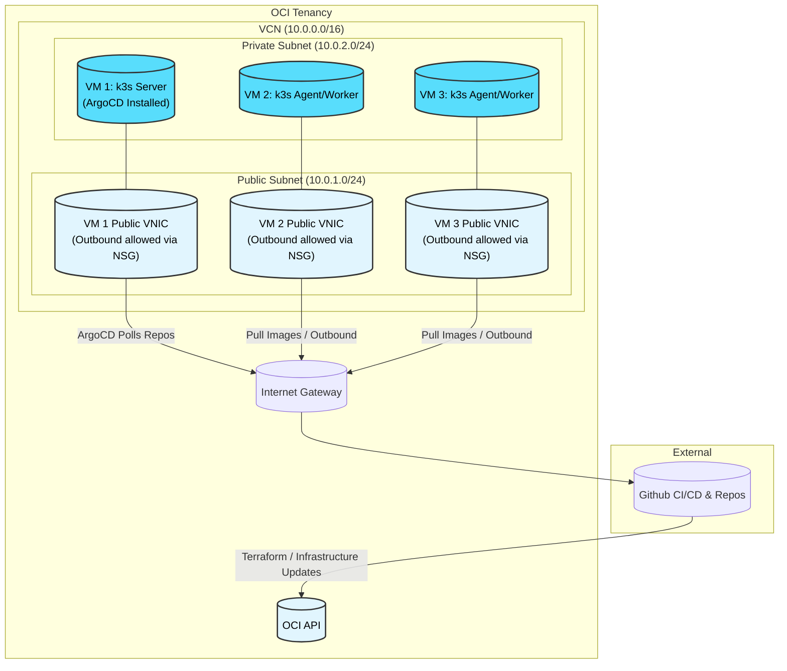

### 1. Network overlay for USER access to app

```mermaid
%%{init: {
  "flowchart": {
    "ranksep": 80,
    "nodesep": 80
  }
}}%%
graph TD
    subgraph "External"
        Users[("App Users")]
    end

    subgraph "OCI Tenancy (VCN: 10.0.0.0/16)"
        IGW[("Internet Gateway")]

        subgraph "Public Subnet (10.0.1.0/24)"
            LB[("Public Load Balancer<br/>(Free Tier)")]
            PubVNIC1[("VM 1 Public VNIC<br/>(Outbound/LB only)")]
            PubVNIC2[("VM 2 Public VNIC<br/>(Outbound/LB only)")]
            PubVNIC3[("VM 3 Public VNIC<br/>(Outbound/LB only)")]
        end

        subgraph "Private Subnet (10.0.2.0/24)"
            MasterVM[("VM 1: k3s Server/Master")]
            AgentVM1[("VM 2: k3s Agent/Worker")]
            AgentVM2[("VM 3: k3s Agent/Worker")]
        end
    end

    Users -- "HTTPS (Port 443)" --> IGW
    IGW <--> LB
    LB -- "App Traffic" --> PubVNIC1
    LB -- "App Traffic" --> PubVNIC2
    LB -- "App Traffic" --> PubVNIC3

    PubVNIC1 --- MasterVM
    PubVNIC2 --- AgentVM1
    PubVNIC3 --- AgentVM2

    classDef public fill:#e1f5fe,stroke:#333,stroke-width:2px,color:#000000;
    classDef private fill:#e8f5e9,stroke:#333,stroke-width:2px,color:#000000;
    classDef vm fill:#58DDFC,stroke:#333,stroke-width:2px,color:#000000;
    class LB,PubVNIC1,PubVNIC2,PubVNIC3 public;
    class MasterVM,AgentVM1,AgentVM2 vm;
```

### 2. Admin access

```mermaid
%%{init: {
  "flowchart": {
    "ranksep": 80,
    "nodesep": 80
  }
}}%%
graph TD
    subgraph "External Ingress"
        Admin[("Administrator")]
    end

    subgraph "OCI Tenancy"
        subgraph "Oracle Services Network (OSN)"
            CloudConsole[("OCI Cloud Console / Shell")]
            API[("OCI API")]
        end

        subgraph "VCN (10.0.0.0/16)"
            subgraph "Private Subnet (10.0.2.0/24)"
                Bastion[("OCI Bastion Service<br/>(Ephemeral & Audited SSH)")]
                MasterVM[("VM 1: k3s Server/Master")]
                AgentVM1[("VM 2: k3s Agent/Worker")]
                AgentVM2[("VM 3: k3s Agent/Worker")]
            end
        end
    end

    Admin -- "MFA Authenticated Session" --> Bastion
    Admin -- "Browser (MFA)" --> CloudConsole
    Admin -- "SSH (MFA)" --> API
    
    Bastion -. "Time-bound SSH" .-> MasterVM
    Bastion -. "Time-bound SSH" .-> AgentVM1
    Bastion -. "Time-bound SSH" .-> AgentVM2

    CloudConsole -. "Direct SSH" .-> MasterVM
    CloudConsole -. "Direct SSH" .-> AgentVM1
    CloudConsole -. "Direct SSH" .-> AgentVM2

    classDef public fill:#e1f5fe,stroke:#333,stroke-width:2px,color:#000000;
    classDef private fill:#e8f5e9,stroke:#333,stroke-width:2px,color:#000000;
    classDef vm fill:#58DDFC,stroke:#333,stroke-width:2px,color:#000000;
    class Bastion,CloudConsole,API public;
    class MasterVM,AgentVM1,AgentVM2 vm;
```

### 3. CI/CD and Deployments

```mermaid
%%{init: {
  "flowchart": {
    "ranksep": 80,
    "nodesep": 80
  }
}}%%
graph TD
    subgraph "External"
        Github[("Github CI/CD & Repos")]
    end

    subgraph "OCI Tenancy"
        API[("OCI API")]
        IGW[("Internet Gateway")]

        subgraph "VCN (10.0.0.0/16)"
            subgraph "Public Subnet (10.0.1.0/24)"
                PubVNIC1[("VM 1 Public VNIC<br/>(Outbound allowed via NSG)")]
                PubVNIC2[("VM 2 Public VNIC<br/>(Outbound allowed via NSG)")]
                PubVNIC3[("VM 3 Public VNIC<br/>(Outbound allowed via NSG)")]
            end

            subgraph "Private Subnet (10.0.2.0/24)"
                MasterVM[("VM 1: k3s Server<br/>(ArgoCD Installed)")]
                AgentVM1[("VM 2: k3s Agent/Worker")]
                AgentVM2[("VM 3: k3s Agent/Worker")]
            end
        end
    end

    Github -- "Terraform / Infrastructure Updates" --> API

    MasterVM --- PubVNIC1
    AgentVM1 --- PubVNIC2
    AgentVM2 --- PubVNIC3

    PubVNIC1 -- "ArgoCD Polls Repos" --> IGW
    PubVNIC2 -- "Pull Images / Outbound" --> IGW
    PubVNIC3 -- "Pull Images / Outbound" --> IGW
    
    IGW --> Github

    classDef public fill:#e1f5fe,stroke:#333,stroke-width:2px,color:#000000;
    classDef private fill:#e8f5e9,stroke:#333,stroke-width:2px,color:#000000;
    classDef vm fill:#58DDFC,stroke:#333,stroke-width:2px,color:#000000;
    class API,PubVNIC1,PubVNIC2,PubVNIC3 public;
    class MasterVM,AgentVM1,AgentVM2 vm;
```
