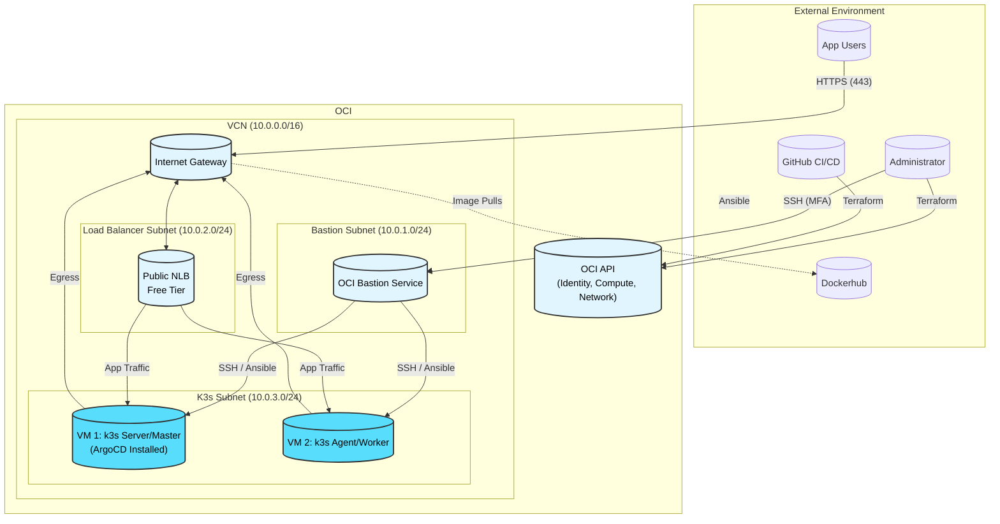

```mermaid
%%{init: {
  "flowchart": {
    "ranksep": 80,
    "nodesep": 100,
    "curve": "basis"
  }
}}%%
graph TD
    %% 1. External Environment (Top)
    subgraph "External Environment"
        Users[("App Users")]
        CI[("GitHub CI/CD")]
        Admin[("Administrator")]
        Dockerhub[("Dockerhub")]
    end

    %% 2. OCI Tenancy Hierarchy
    subgraph "OCI"
        OCI-API[("OCI API<br/>(Identity, Compute, Network)")]
        
        subgraph "VCN (10.0.0.0/16)"
            IGW[("Internet Gateway")]

            subgraph "Bastion Subnet (10.0.1.0/24)"
                Bastion[("OCI Bastion Service")]
            end

            subgraph "Load Balancer Subnet (10.0.2.0/24)"
                LB[("Public NLB<br/>Free Tier")]
            end

            subgraph "K3s Subnet (10.0.3.0/24)"
                MasterVM[("VM 1: k3s Server/Master<br/>(ArgoCD Installed)")]
                AgentVM1[("VM 2: k3s Agent/Worker")]
            end        
        end
    end

    %% 3. Force Vertical Stacking (Invisible Link)
    Admin ~~~ OCI-API

    %% 4. Connections (Flowing Downward)
    
    %% Management & Deployment
    Admin -- "Terraform" --> OCI-API
    Admin -- "SSH (MFA)" --> Bastion
    CI -- "Terraform" --> OCI-API
    CI -- "Ansible" --> Bastion
    
    %% Bastion Tunnels
    Bastion -- "SSH / Ansible" --> MasterVM
    Bastion -- "SSH / Ansible" --> AgentVM1
    
    %% Application Traffic
    Users -- "HTTPS (443)" --> IGW
    IGW <--> LB
    LB -- "App Traffic" --> MasterVM
    LB -- "App Traffic" --> AgentVM1

    %% Egress & Images
    MasterVM -- "Egress" --> IGW
    AgentVM1 -- "Egress" --> IGW
    IGW -. "Image Pulls" .-> Dockerhub

    %% Styling
    classDef public fill:#e1f5fe,stroke:#333,stroke-width:2px,color:#000000;
    classDef private fill:#e8f5e9,stroke:#333,stroke-width:2px,color:#000000;
    classDef vm fill:#58DDFC,stroke:#333,stroke-width:2px,color:#000000;
    
    class LB,Bastion,OCI-API,IGW public;
    class MasterVM,AgentVM1 vm;
    
    %% Hide the layout-enforcement link
    linkStyle 4 stroke-width:0px;
```