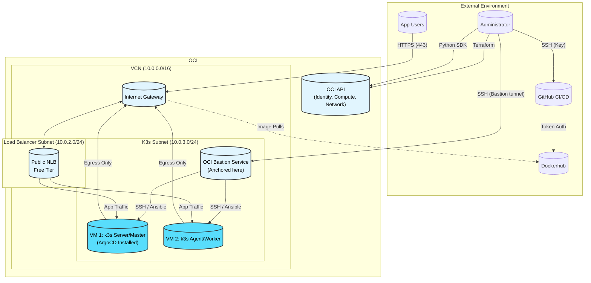

# Infrastructure

The project is deployed to a two-node k3s cluster in Oracle Cloud Infrastructure (OCI) using only always free tier resources. Below is the overall layout of the environment.

Installation steps can be found from the ansible subdirectory in [readme.md](ansible/readme.md).

## Layout



## Compartments
```text
└── root (Tenancy)
    ├── Tenancy Level Resources
    │    └── Cloud Guard, Events, Notifications, Flow Logs, IAM Policies, Budget (All Free Tier)
    │
    └── Project compartment (Parent Compartment)
         ├── 1. Network (Child Compartment)
         │    └── Resources: VCN, Public Subnet, IGW, Route Tables, NSGs
         │
         ├── 2. Compute (Child Compartment)
         │    └── Resources: VM Instances, Boot/Block Volumes
         │
         └── 3. Security & Access (Child Compartment)
              └── Resources: OCI Bastion Service, Load Balancer, Certificates, Vault/KMS
```

## Resources

The assets are divided into two categories, the ones created by the tenancy administrator in the initial phase (Tenancy level resources) and the project assets created by either the tenancy administrator or a service account (Project resources).

### Tenancy resources

These are the foundational resources created by the tenancy administrator during the initial setup to establish the environment and security framework:

- **Compartments:**
  - `Project compartment` (Parent Compartment)
  - Child Compartments: `Network`, `Compute`, `Security & Access`
- **Identity and Access Management (IAM):**
  - Administrators Group
  - Project admins group
  - IAM Policies (e.g., Compartment Admin Policy for the service account)
- **Security & Observability:**
  - Object storage bucket for backend.tf
  - Events & Notifications
  - Flow Logs
  - Budget

### Project resources

These resources are created and managed strictly within the `Project compartment` scope, potentially by automated CI/CD pipelines or service accounts:

- **Network:**
  - Virtual Cloud Network (VCN) - 10.0.0.0/16
  - Public Subnet (Load Balancer subnet) - 10.0.2.0/24
  - Public Subnet (K3s subnet) - 10.0.3.0/24
  - Internet Gateway (IGW)
  - Route Tables & Network Security Groups (NSGs)
- **Compute:**
  - VM 1: k3s Server/Master (Ampere A1 - Free Tier)
  - VM 2: k3s Agent/Worker (Ampere A1 - Free Tier)
  - Boot and Block Volumes
- **Security & Access:**
  - OCI Bastion Service (Ephemeral & Audited SSH)
  - Public Load Balancer (Free Tier - HTTPS/HTTP)
  - Certificates & Vault/KMS

## Identity and Access Management

As this is a solo project, there's not much need to fine-tune IAM policies on tenancy level. However for service accounts and pipelines to operate in the scope they're planned to, compartment admin role must be created. For simplicity, we grant this group access to all resources in their own compartment.

```text
└── Tenancy (Root)
    ├── Administrators Group (Solo Developer)
    │    └── Full access to all tenancy resources
    │
    └── Project admins group (Service Account)
         └── Compartment Admin Policy
              └── Scoped access to 'Project compartment'
```