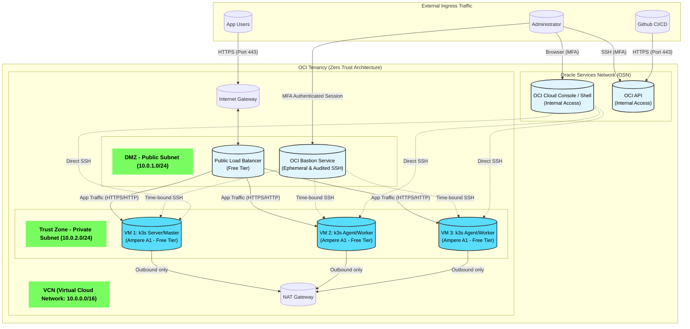

```mermaid
%%{init: {
  "flowchart": {
    "ranksep": 100,   // vertical space between rows
    "nodesep": 100    // horizontal space between nodes
  }
}}%%
graph TD
    subgraph "OCI Tenancy (Zero Trust Architecture)"
        subgraph "Oracle Services Network (OSN)"
            CloudConsole[("OCI Cloud Console / Shell<br/>(Internal Access)")]
            API[("OCI API<br/>(Internal Access)")]
        end
        subgraph "" 
            direction LR
            VCN["VCN (Virtual Cloud Network: 10.0.0.0/16)"]:::subTitle         
            IGW[("Internet Gateway")]
            NAT[("NAT Gateway")]

            subgraph "" 
                direction LR
                PUS["DMZ - Public Subnet (10.0.1.0/24)"]:::subTitle 
                LB[("Public Load Balancer<br/>(Free Tier)")]
                Bastion[("OCI Bastion Service<br/>(Ephemeral & Audited SSH)")]
            end

            subgraph "" 
                direction LR
                PRS["Trust Zone - Private Subnet (10.0.2.0/24)"]:::subTitle
                MasterVM[("VM 1: k3s Server/Master<br/>(Ampere A1 - Free Tier)")]
                AgentVM1[("VM 2: k3s Agent/Worker<br/>(Ampere A1 - Free Tier)")]
                AgentVM2[("VM 3: k3s Agent/Worker<br/>(Ampere A1 - Free Tier)")]
            end

            IGW <--> LB
            LB -- "App Traffic (HTTPS/HTTP)" --> MasterVM
            LB -- "App Traffic (HTTPS/HTTP)" --> AgentVM1
            LB -- "App Traffic (HTTPS/HTTP)" --> AgentVM2
            
            Bastion -. "Time-bound SSH" .-> MasterVM
            Bastion -. "Time-bound SSH" .-> AgentVM1
            Bastion -. "Time-bound SSH" .-> AgentVM2

            MasterVM -- "Outbound only" --> NAT
            AgentVM1 -- "Outbound only" --> NAT
            AgentVM2 -- "Outbound only" --> NAT
        end

        CloudConsole -. "Direct SSH" .-> MasterVM
        CloudConsole -. "Direct SSH" .-> AgentVM1
        CloudConsole -. "Direct SSH" .-> AgentVM2
    end

    subgraph "External Ingress Traffic"
        Admin[("Administrator")]
        Users[("App Users")]
        Github[("Github CI/CD")]
    end

    Admin -- "MFA Authenticated Session" --> Bastion
    Admin -- "Browser (MFA)" --> CloudConsole
    Admin -- "SSH (MFA)" --> API
    Users -- "HTTPS (Port 443)" --> IGW
    Github -- "HTTPS (Port 443)" --> API


    classDef public fill:#e1f5fe,stroke:#333,stroke-width:2px,color:#000000;
    classDef private fill:#fff3e0,stroke:#333,stroke-width:2px,color:#000000;
    classDef vm fill:#58DDFC,stroke:#333,stroke-width:2px,color:#000000;
    classDef subTitle fill:#78FC60, stroke:none, color:#000, font-size:18px, font-weight:bold, text-anchor:start;
    classDef invis fill:none,stroke:none;
    class spacer invis;
    class LB,Bastion,CloudConsole,API public;
    class MasterVM,AgentVM1,AgentVM2 private;
    class MasterVM,AgentVM1,AgentVM2 vm;
```